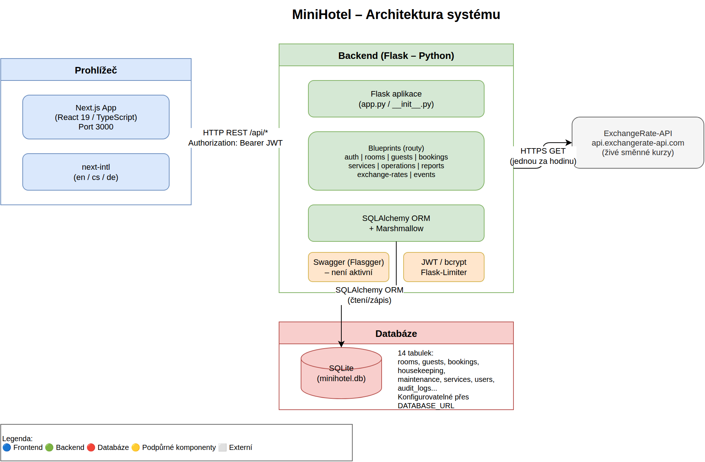
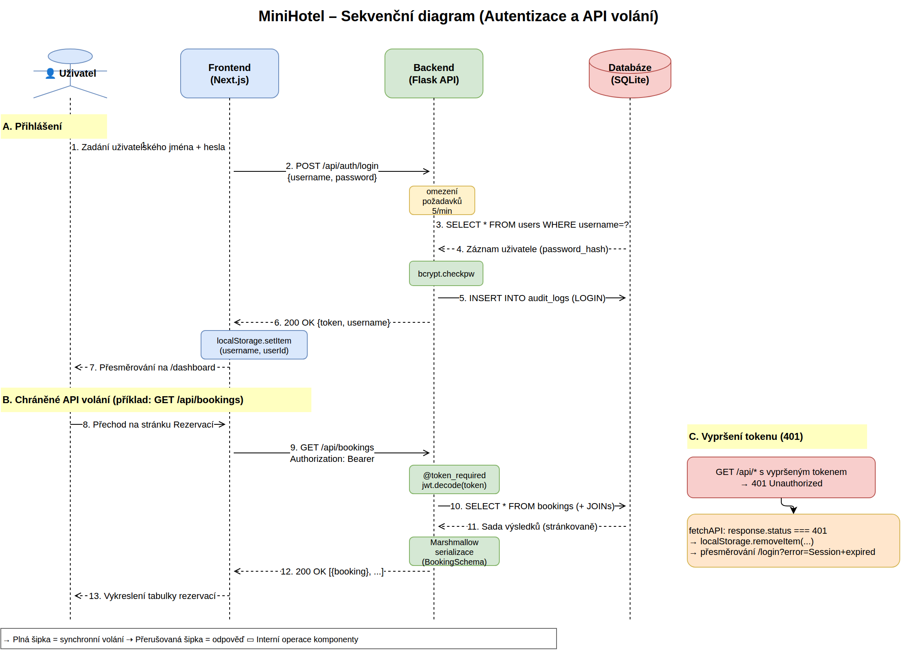

# Technická dokumentace: MiniHotel

## 1. Úvod
### 1.1 Účel dokumentu
Tento dokument popisuje technický návrh, architekturu a implementační detaily informačního systému MiniHotel. Slouží jako hlavní referenční materiál pro vývojáře, systémové administrátory a další technické pracovníky.

### 1.2 Cílové publikum
Dokument je určen pro:
* Softwarové inženýry a vývojáře
* Databázové administrátory
* DevOps inženýry
* Technické manažery projektu

### 1.3 Slovníček pojmů a zkratek
* **IS:** Informační systém
* **API:** Application Programming Interface
* **JWT:** JSON Web Token
* **ORM:** Object-Relational Mapping
* **i18n:** internacionalizace

## 2. Celkový popis systému
### 2.1 Kontext systému
MiniHotel je monorepo systém pro správu hotelového provozu. Řeší evidenci pokojů, hostů, rezervací, úklidu, údržby, služeb, reportingu a směnných kurzů. Hlavním cílem je centralizovat provozní agendu do webové aplikace s REST API.

### 2.2 Architektura na nejvyšší úrovni
Systém je rozdělen na dvě hlavní části:
* **Frontend (`/frontend`)** – Next.js aplikace pro obsluhu systému.
* **Backend (`/backend`)** – Flask REST API s business logikou a přístupem k databázi.

Diagram architektury: [`diagrams/cs-01-architektura-systemu.drawio.xml`](diagrams/cs-01-architektura-systemu.drawio.xml)

Interakce:
* Frontend volá backend endpointy přes `/api/*`.
* Backend obsahuje Flasgger pro Swagger/OpenAPI dokumentaci; aktuálně není inicializován.

## 3. Technologický stack
Výčet technologií použitých při vývoji a provozu systému.
* **Frontend:** Next.js 16, React 19, TypeScript, Tailwind CSS 4, next-intl
* **Backend:** Python, Flask 3, Flask-SQLAlchemy, Marshmallow, PyJWT, Flask-Cors, Flask-Limiter, Flasgger
* **Databáze:** SQLite (výchozí `sqlite:///minihotel.db`), možnost změny přes `DATABASE_URL`
* **Mezipaměť (Cache):** Není doložena samostatná cache vrstva
* **Infrastruktura a Cloud:** Není pevně definováno; dokumentace zmiňuje možnost nasazení přes WSGI server

## 4. Architektura a návrh
### 4.1 Datový model
Popis struktury databáze.
* **Popis hlavních entit:**  
  `RoomGroup`, `SeasonalRate`, `Service`, `BookingService`, `Room`, `Guest`, `Booking`, `Housekeeping`, `Maintenance`, `Contact`, `User`, `AuditLog`, `ExchangeRate`, `Event`.

Klíčové relace:
* `Booking` → `Guest` (N:1)
* `Booking` → `Room` (N:1)
* `Booking` ↔ `Service` přes `BookingService` (M:N)
* `Room` → `RoomGroup` (N:1)
* Hierarchie `RoomGroup` přes `parent_group_id`

### 4.2 Uživatelské rozhraní (UI)
Základní principy návrhu frontendové části.
* Wireframy/Figma/Adobe XD nejsou v repozitáři doloženy.
* Routování je postaveno na Next.js App Router + `next-intl` locale routing.
* Aktivní lokality: `en`, `cs`, `de`.

## 5. Rozhraní a API
### 5.1 Interní API
Popis API endpointů, které systém poskytuje.
* **Architektonický styl:** REST
* **Autentizace API:** Bearer token (JWT)
* **Dokumentace endpointů:** Flasgger je obsažen v `requirements.txt` a endpointy nesou Swagger YAML komentáře, avšak Flasgger není aktuálně inicializován; Swagger UI na `/docs` proto **není aktivní** v aktuálním kódu.

Registrované backend blueprints:
* `/api/auth`
* `/api/rooms`
* `/api/guests`
* `/api/bookings`
* `/api/services`
* `/api/housekeeping`, `/api/maintenance`, `/api/contacts` (operations)
* `/api/reports`
* `/api/exchange-rates`
* `/api/events`

### 5.2 Externí integrace
Seznam a popis integrací se systémy třetích stran.
* **ExchangeRate-API (`https://api.exchangerate-api.com/v4/latest/CZK`):** backend načítá živé směnné kurzy (endpoint exchange rates).
* Další externí integrace nejsou v repozitáři jednoznačně doloženy.

## 6. Bezpečnost
### 6.1 Autentizace a autorizace
* Přihlášení probíhá přes `POST /api/auth/login` (jméno + heslo).
* Hesla jsou hashována pomocí `bcrypt`.
* Backend vydává JWT token podepsaný `SECRET_KEY`.
* Chráněné endpointy používají dekorátor `token_required`.
* Login endpoint má rate limit (`5 per minute`).

Sekvenční diagram autentizace: [`diagrams/cs-03-sekvencni-diagram-autentizace.drawio.xml`](diagrams/cs-03-sekvencni-diagram-autentizace.drawio.xml)

### 6.2 Uživatelské role a oprávnění
V aktuální implementaci je doložen model jednoho typu uživatele (`User`) bez explicitního RBAC členění na více rolí.  
Přístup je řešen binárně: autentizovaný vs. neautentizovaný uživatel.

### 6.3 Ochrana dat
* Při přenosu: v lokálním vývoji HTTP; pro produkci je nutné nasadit HTTPS/TLS na úrovni infrastruktury.
* V klidu: explicitní šifrování databáze není v repozitáři doloženo.

## 7. Infrastruktura a nasazení
### 7.1 Požadavky na prostředí
Minimálně:
* Python 3.x
* Node.js + npm
* OS schopný spustit Flask a Next.js
* Síťová dostupnost portů 5000 (backend) a 3000 (frontend) ve vývoji

### 7.2 Proces nasazení (CI/CD)
* Nástroje pro CI/CD: nejsou v dostupném kontextu jednoznačně doloženy.
* Build/Test/Deploy pipeline není v této dokumentaci specifikována kvůli chybějícím podkladům.

### 7.3 Logování a monitoring
* Aplikační auditní záznamy jsou ukládány do tabulky `AuditLog`.
* Centrální monitoring (ELK/Sentry/Datadog) není v repozitáři doložen.

## 8. Testování
* **Jednotkové testy (Unit testing):** v backendu jsou přítomné skripty (`testing.py`, `test_500.py`), ale není doložen standardní runner (např. pytest) ani metrika pokrytí.
* **Integrační testy:** nejsou explicitně popsány.
* **End-to-end testování (E2E):** nástroje jako Cypress/Playwright nejsou v repozitáři doloženy.

## 9. Známá omezení a technický dluh
* Chybí doložený standardizovaný CI/CD proces.
* Chybí explicitní role-based access control.
* Chybí dokumentované databázové migrace (např. Alembic/Flask-Migrate).
* Výchozí SQLite není ideální pro vyšší produkční zátěž.
* Chybí doložená centralizovaná observabilita (monitoring/alerting).

## 10. Přílohy a odkazy
* Repozitář: `quackextractor/MiniHotel`
* Root dokumentace: `../README.md`
* Backend dokumentace: `../backend/README.md`
* Frontend dokumentace: `../frontend/README.md`
* Český uživatelský manuál: `../frontend/manual/manual-CZ.html`
* Anglická verze tohoto dokumentu: `TECHNICAL-DOCUMENTATION.md`
* Diagram architektury systému: `diagrams/cs-01-architektura-systemu.drawio.xml`
* Sekvenční diagram (autentizace): `diagrams/cs-03-sekvencni-diagram-autentizace.drawio.xml`
